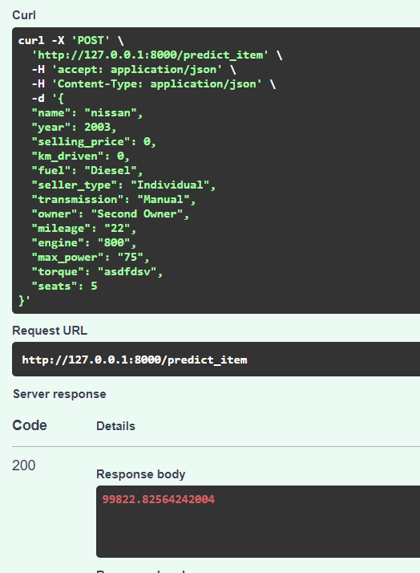
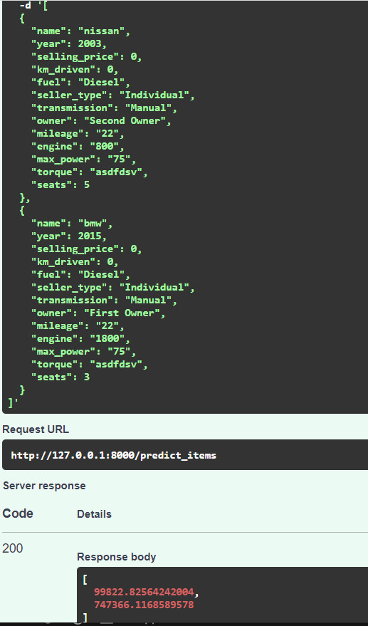

Домашнее задание 1

Изначально набор данных содержал 12 столбцов признаков: 3 числовых и 9 категориальных.
В наборе данных присутствовали пропущенные значения и дубликаты. Пропущенные значения были заменены
медианными значениями, а все дубликаты за исключением первого появления были удалены. Также
был удале столбец torque. Закодировал столбец name, отобрав по первому токену премиальные или околопремиальные модели и обычные. Возвел значение года в квадрат. Столбцы mileage, engine и 
max_power из строковых записей переделал в вещественные значения, а пропуски заполнил медианами.
Отмасштабировал числовые столбцы с помощью StandardScaler, а категориальные преобразовал методом One-Hot Encoding

Результат финальной модели
r2_score: 0.87

Значительный буст дала предобработка поля name с разделением автомобилей на обыкновенные и премиум класса + логарифмирование таргета и обучение в таком формате

Результаты раюоты модели

